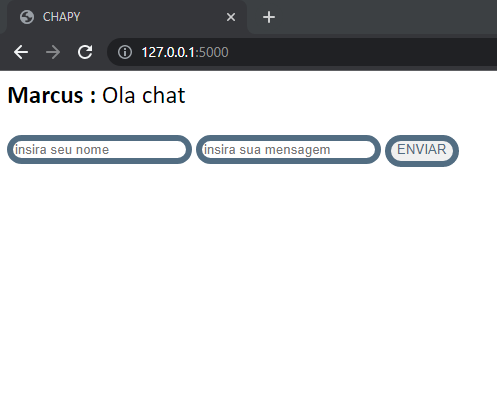

# CHAPY

Um chat simples desenvolvido em python com auxilio do Flask e Flask Socketio, para criação do back-end, junto ao Javascript, o intuido do prjeto e ser simples porem interressante pois teve a junção de: python + javscript + Html e css.

E tudo bem simples, o envio a escretia e o layout.

### CHAPY:

### Ferramentas utilizadas:

[Flask](https://flask.palletsprojects.com/en/2.3.x/)

[Flask-SocketIO](https://flask-socketio.readthedocs.io/en/latest/)

[Socket.IO](https://socket.io/)